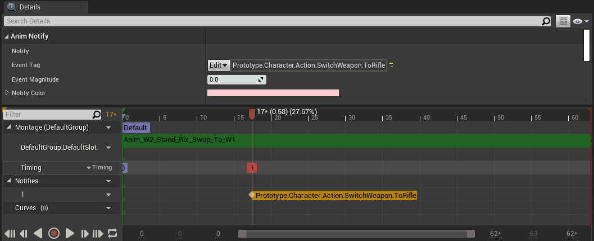
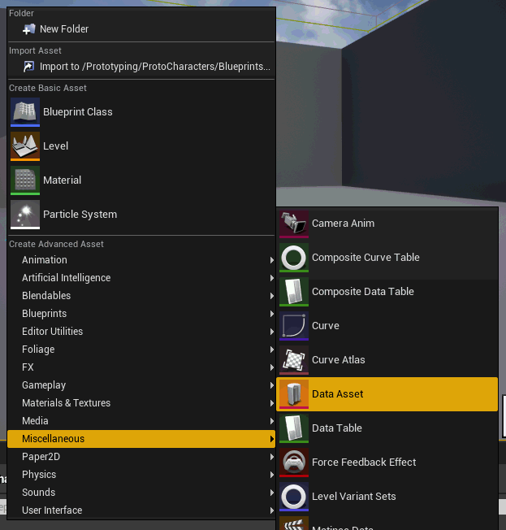
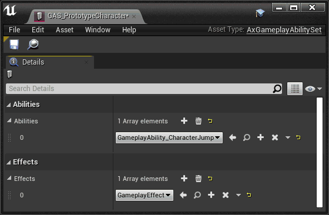

#  GameplayAbility Extensions

*Fair Warning:  This is a C++ plugin for UE5*

Plugin for some common things I often find myself needing when working with the GameplayAbility plugin.  It's broken up into modules so that you can pick and choose what you need.

Much of this is a mash-up of tranek's fantastic [GASShooter](https://github.com/tranek/GASShooter) and [GASDocumentation](https://github.com/tranek/GASDocumentation), along with some parts from Epic's Valley of the Ancients demo, and the sample project ActionRPG.

The intent is to move a lot of common/useful functionality into a project agnostic plugin that can be re-used.  I try to expose functionality to blueprints, but it's expected that a dev will be using both C++ and blueprints.

> Documentation is poor.  I'm working on it.

## Module: AxCommon

Core functionality for the plugin.  `UAxAbilitySystemComponent` and `UAxGameplayAbility` make up the bulk of this module, but there's also some helpers for attributes, animations, debugging, AI and the EnhancedInput.

## Module: AxModularGameplay

A set of replacement actors for pawns, characters, game modes, player states, ai and player controllers that support the `ModularGameplay` features added in UE5, and are also set up out of the box for working with gameplay abilities.

The controller and pawn actors register themselves with the `UGameFrameworkComponentManager` so they can be used with `ModularGameplay`.

For players, the ability system component exists on the `AModularPlayerState`, and for AI it's on `AModularAIController`.  The pawns, `AModularPawn` and `AModularCharacter`, pick these up from either the controller or the player state and re-expose them for ease of use.

Pawns also have a startup ability set that is automatically applied when they receive their ability system.

## Other modules:  AxInteractions and AxWeapons

These are still very much in flux, and I don't really recommend using them.  I move code from my main project into these if I can abstract them away from the game sufficiently, but they're very volatile.

## Helpers (in no particular order)

> still working on updating this list ;)

### AnimNotify_SendGameplayEvent

Animation notify for sending a gameplay event to the owning actor.



> When prototyping, I have a GameplayAbility that forwards the event to the actor's blueprint for easy testing.  In my actual game, I use this for things like equip/unequip.

### AxGameplayAbilitySet

A data asset that is collection of GameplayAbilities _and_ effects that can easily be given to a character.  Make sure you choose `AxGameplayAbilitySet` and not `GameplayAbilitySet`.





> I often use these to grant collections of abilities on character startup or when equipping a weapon, but they can also be used to apply multiple effects from a GameplayAbility.  GameplayTags can be granted to a character this way as well through the use of a startup GameplayEffect that grants the tags.

```
/** Called by ::PossessedBy(...) or ::OnRep_Controller() */
void APrototypeCharacter::AddStartupGameplayAbilities()
{
	check(AbilitySystemComponent);

	if (GetLocalRole() == ROLE_Authority && StartupAbilitySet && !StartupAbilitySetHandles.Any())
	{
		StartupAbilitySet->Give(GetAbilitySystemComponent(), this, GetCharacterLevel(), StartupAbilitySetHandles);
	}
}
```
