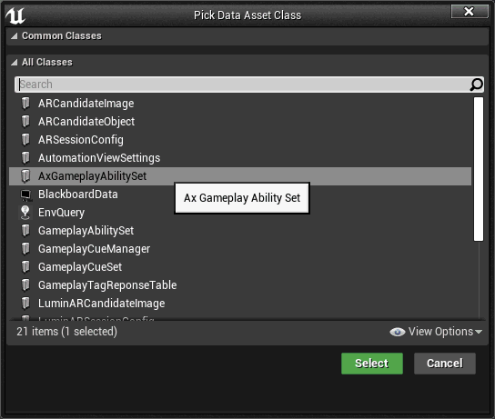

#  GameplayAbility Extensions

*Fair Warning:  This is a C++ plugin for UE4*

**Depends on EnhancedInput plugin**

Helpers for working with the GameplayAbilities plugin

## Helpers (in no particular order)

### AnimNotify_SendGameplayEvent

Animation notify for sending a gameplay event to the owning actor.


> When prototyping, I have a GameplayAbility that forwards the event to the actor's blueprint for easy testing.  In my actual game, I use this for things like equip/unequip.

### UAxGameInstanceSubsystem

GameInstance subsystem that will call `UAbilitySystemGlobals::Get().InitGlobalData();` so you don't have to remember to add that somewhere.

### AxGameplayAbilitySet

A data asset that is collection of GameplayAbilities _and_ effects that can easily be given to a character.  Make sure you choose `AxGameplayAbilitySet` and not `GameplayAbilitySet`.





> I often use these to grant collections of abilities on character startup or when equipping a weapon, but they can also be used to apply multiple effects from a GameplayAbility.  GameplayTags can be granted to a character this way as well through the use of a startup GameplayEffect that grants the tags.

```
/** Called by ::PossessedBy(...) or ::OnRep_Controller() */
void APrototypeCharacter::AddStartupGameplayAbilities()
{
	check(AbilitySystemComponent);

	if (GetLocalRole() == ROLE_Authority && StartupAbilitySet && !StartupAbilitySetHandles.Any())
	{
		StartupAbilitySet->Give(GetAbilitySystemComponent(), this, GetCharacterLevel(), StartupAbilitySetHandles);
	}
}
```
